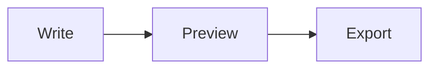

# Markdown Syntax Guide

A reference for the markdown flavor supported by this editor. Every example
below shows the source, and — where useful — how it renders.

## Headings

```markdown
# Heading 1
## Heading 2
### Heading 3
#### Heading 4
##### Heading 5
###### Heading 6
```

## Paragraphs & Line Breaks

Paragraphs are separated by a blank line. Single newlines inside a paragraph
are joined together — insert a blank line to start a new paragraph.

## Emphasis

```markdown
*italic* or _italic_
**bold** or __bold__
***bold italic***
~~strikethrough~~
```

Renders as: *italic*, **bold**, ***bold italic***, ~~strikethrough~~.

## Links

```markdown
[link text](https://example.com)
[with title](https://example.com "Tooltip")
<https://example.com>
```

Plain URLs like https://example.com are auto-linked.

## Images

```markdown


```

## Lists

Unordered — `-`, `*`, or `+`:

```markdown
- item
- item
  - nested item
```

Ordered — any number followed by `.`:

```markdown
1. first
2. second
3. third
```

Tasks:

```markdown
- [ ] todo
- [x] done
```

## Blockquotes

```markdown
> A quote.
>
> A second paragraph in the quote.
```

## Horizontal Rule

```markdown
---
```

## Inline Code

Wrap with backticks: `` `let x = 1;` `` renders as `let x = 1;`.

## Fenced Code Blocks

Open and close with three backticks. Add a language identifier for syntax
highlighting:

    ```ts
    function greet(name: string) {
      return `Hello, ${name}`;
    }
    ```

Renders as:

```ts
function greet(name: string) {
  return `Hello, ${name}`;
}
```

## Tables

```markdown
| Name  | Role     | Years |
| ----- | -------- | ----: |
| Aria  | Designer |     3 |
| Theo  | Engineer |     7 |
```

| Name  | Role     | Years |
| ----- | -------- | ----: |
| Aria  | Designer |     3 |
| Theo  | Engineer |     7 |

Use `:---`, `---:`, or `:---:` in the separator row to align left, right, or
center.

## Math (KaTeX)

Inline math with single dollars: `$a^2 + b^2 = c^2$` renders as $a^2 + b^2 = c^2$.

Block math with double dollars:

```markdown
$$
\int_0^\infty e^{-x^2}\,dx = \frac{\sqrt{\pi}}{2}
$$
```

$$
\int_0^\infty e^{-x^2}\,dx = \frac{\sqrt{\pi}}{2}
$$

## Diagrams (Mermaid)

Use a `mermaid` fenced code block:

    ```mermaid
    graph LR
      A[Write] --> B[Preview]
      B --> C[Export]
    ```

Renders as:



## Front Matter

Optional YAML block at the very top of the document:

```markdown
---
title: My Document
author: Jane
---
```

## HTML Passthrough

Raw HTML works inside markdown — useful for things like <kbd>Ctrl</kbd>+<kbd>S</kbd>
or anchor targets.

## Typography

The preview smart-converts punctuation: `--` → en-dash, `---` → em-dash, and
straight quotes become curly.

## Escaping

Prefix a character with a backslash to render it literally. For example,
`\*not italic\*` renders as \*not italic\*.
